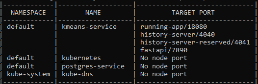
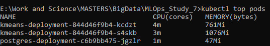
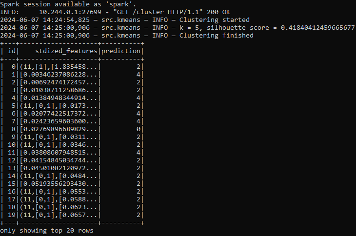
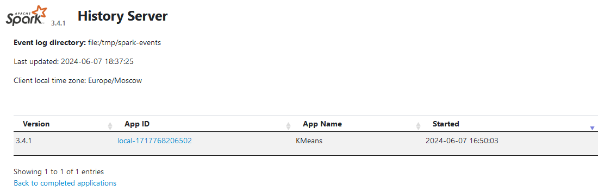
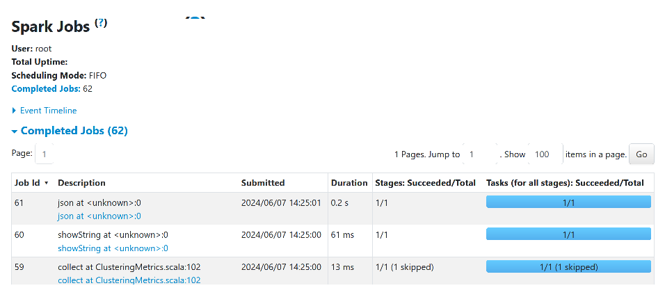

## MLOps_Study_8 (Finalize MLOps_studies 5-7 into K8s)

This repo is dedicataed to finalizing all the applications made in works 5-7 as pods inside k8s cluster (or in minikube locally).
Made by Domnitsky Egor M4130.

# Config

2 Services:
- Kmeans clusterizer (PySpark app + Spark Scala Datamart + FastAPI) - Extrernal
- PostgreSQL container with populated tables - Internal

For details see `yml` files

# Result
`minikube service list`

`kubectl top nods` (with metric-server addon enabled and running)

`curl -X GET 127.0.0.1:43878/cluster -H "Content-Type: application/json" -H "Accept: application/json" -d @query.json`

**Check history and jobs**

